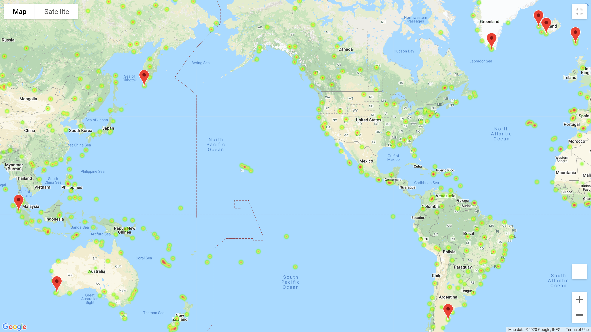

# A Look at Global Weather Patterns

*Using gmaps to display a heatmap with locations of hotels based on my weather parameter inputs*
      

## Background ##
In this repo, I gathered global data on current weather conditions thru API calls on OpenWeather and then ran a series of linear regressions, looking for weather patterns.  And then for fun, I set up my own parameters for what I want my vacation weather to be, and then created a list of potential hotels and plotted them using gmaps.     

In a subsequent repo, I put all of the linear regression graphs and written analysis into a webpage.  You can find that repo [here](https://github.com/VallieTracy/Web-Design-Challenge).

### Should you choose to clone this repo to your desktop and follow along, some things to note: ###
1. <b>You'll need two API keys, one for Open Weather Map, and one for Google</b>
      + DON'T FORGET TO ADD A GITIGNORE     
      + Links below to where you can get your own API keys 
      + To more easily follow along with my code, I placed both API keys inside a file called `config.py`, which is located in the `WeatherPy` folder and on the same level as the WeatherPy and VacationPy jupyter notebooks 
      + I titled both keys `g_key` & `weather_api_key`       
2. <b>In the [`WeatherPy Jupyter Notebook'](https://github.com/VallieTracy/python-api-challenge/blob/master/WeatherPy/WeatherPy.ipynb), notice lines 23 and 24 in cell 1</b>  
      + Under a free subscription to Open Weather, you get 60 API calls/minute     
      + So in order to not get a temporary block from the service, you'll need to add the line of code `time.sleep(1)` in cell 3
      + With my code, you'll get ~600 cities, so it will take roughly 10 miniutes.  To avoid the wait, you can alter the latitudes and longitudes in `cell 1` and play around more quickly with the data until you're ready to run the full kit-and-caboodle 
3. <b>Information on the `cities.csv` located in the `WeatherPy` folder</b>  
      + The csv is created in the fifth cell, after the api calls have been performed    
      + You can copy the csv into your own cloned repo and it will just be overwritten when you run your own api calls 
      + I created the csv so that I could create a Pandas dataframe and run linear regression on the data
4. <b>The difference between `WeatherPy` and `VacationPy`:</b> 
      + I created VacationPy so that I could alter my parameters based on vacation criteria that I wanted  
      + You'll need to run WeatherPy *first* seeing as VacationPy utilizes the cities.csv created there
      + You can run the code and put in your own weather criteria so as to create your own list of hotels for vacation!
      
## Helpful Links ##
https://openweathermap.org/api      
https://developers.google.com/places/web-service/get-api-key
 

