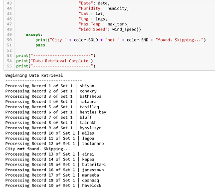

# A Look at Global Weather Patterns
*Gathering global data on current weather conditions thru API calls and then running a series of linear regressions, looking for weather patterns.  And then finding a list of hotels for vacation spots based on my own weather specs!* 

 

### Should you choose to clone this repo to your desktop and follow along, some things to note: ###
1. <b>You'll need two API keys, one for Open Weather Map, and one for Google</b>
      + DON'T FORGET TO ADD A GITIGNORE     
      + Links below to where you can get your own API keys 
      + To more easily follow along with my code, I placed both API keys inside a file called `config.py`, which is located in the `WeatherPy` folder and on the same level as the WeatherPy and VacationPy jupyter notebooks 
      + I titled both keys `g_key` & `weather_api_key`       
2. <b>In the [`WeatherPy Jupyter Notebook'](https://github.com/VallieTracy/python-api-challenge/blob/master/WeatherPy/WeatherPy.ipynb), notice lines 23 and 24 in cell 1</b>  
      + Under a free subscription to Open Weather, you get 60 API calls/minute     
      + So in order to not get a temporary block from the service, you'll need to add the line of code `time.sleep(1)` in cell 3
      + With my code, you'll get ~600 cities, so it will take roughly 10 miniutes.  To avoid the wait, you can alter the latitudes and longitudes in `cell 1` and play around more quickly with the data until you're ready to run the full kit-and-caboodle 
3. <b>Information on the `cities.csv` located in the `WeatherPy` folder</b>  
      + The csv is created in the fifth cell, after the api calls have been performed    
      + You can copy the csv into your own cloned repo and it will just be overwritten when you run your own api calls 
      + I created the csv so that I could create a Pandas dataframe and run linear regression on the data
4. <b>The difference between `WeatherPy` and `VacationPy`:</b> 
      + I created VacationPy so that I could alter my parameters based on vacation criteria that I wanted  
      + You'll need to run WeatherPy *first* seeing as VacationPy utilizes the cities.csv created there
      + You can run the code and put in your own weather criteria so as to create your own list of hotels for vacation!
      
## Helpful Links ##
https://openweathermap.org/api      
https://developers.google.com/places/web-service/get-api-key
          

Background
----------

Whether financial, political, or social -- data's true power lies in its ability to answer questions definitively. So let's take what you've learned about Python requests, APIs, and JSON traversals to answer a fundamental question: "What's the weather like as we approach the equator?"
Now, we know what you may be thinking: "Duh. It gets hotter..."
But, if pressed, how would you prove it?

*WeatherPy Objectives*
-------------------
In WeatherPy, I'll be creating a Python script to visualize the weather of 500+ cities across the world of varying distance from the equator. To accomplish this, I will utilize a simple Python library, the OpenWeatherMap API, and a little common sense to create a representative model of weather across world cities.
My first objective is to build a series of scatter plots to showcase the following relationships:

*Temperature (F) vs. Latitude*          
*Humidity (%) vs. Latitude*         
*Cloudiness (%) vs. Latitude*        
*Wind Speed (mph) vs. Latitude*         

My next objective is to run a linear regression on each relationship, separating them by Northern and Southern Hemisphere:

*Northern Hemisphere - Temperature (F) vs. Latitude*     
*Southern Hemisphere - Temperature (F) vs. Latitude*     
*Northern Hemisphere - Humidity (%) vs. Latitude*     
*Southern Hemisphere - Humidity (%) vs. Latitude*     
*Northern Hemisphere - Cloudiness (%) vs. Latitude*     
*Southern Hemisphere - Cloudiness (%) vs. Latitude*     
*Northern Hemisphere - Wind Speed (mph) vs. Latitude*     
*Southern Hemisphere - Wind Speed (mph) vs. Latitude*     

*VacationPy Objectives*
-----------------------
In VacationPy, I'll use jupyter-gmaps and the Google Places API in conjunction with my weather data to plan future vacations. 

First I'll create a heat map that displays the humidity for every city in my cities.csv file I created in WeatherPy.

And then I'll narrow down the dataframe with my ideal vacation conditions (which happen to be a Max Temp > 80 F, Humidity < 60, and Wind Speed either less than 5 mph, or greater than 30 mph).

Lastly, to help my vacation planning, I'll use Google Places API to find the first hotel for each city located within 5000 meters of my ideal conditions.  To bring it all together, I'll plot the hotels on top of the humidity heatmap with a pin that contains the hotel name, city, and country.

  

  

